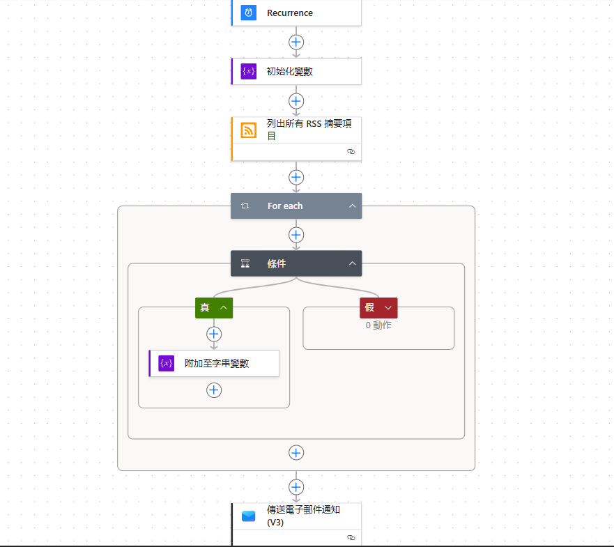
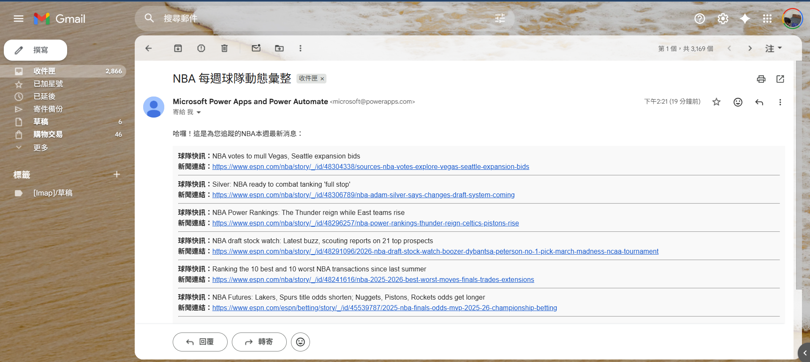

# NBA 每週賽事自動化報表系統

## 專案簡介
本專案利用 **Microsoft Power Automate** 實現 NBA 相關動態監控。
透過串接 ESPN RSS 數據，系統每週定時過濾特定關鍵字(如:NBA、Spurs)之新聞，並自動彙整發送至指定電子郵件。

## 技術
* **Schedule Trigger**: 設定週一早上定時執行，確保獲取週末賽事總結。
* **Variable Aggregation**: 運用 `Append to string variable` 技術，將非結構化的多則 RSS 數據聚合為單一 HTML 報表。
* **Logic Filtering**: 使用迴圈 (For each) 與條件判斷 (Condition)，精確篩選所需資訊。
* **HTML Rendering**: 透過 HTML 標籤美化電子郵件輸出排版。

## 檔案說明
* `NBA-Weekly-Report.zip`: Power Automate 流程套件（可匯入至個人環境使用）。
* `images`: 流程架構邏輯圖。

  

## 成果預覽
以下為設定之帳號會收到的郵件內容呈現，用戶可以每周固定收到最新通知:

## 醫資領域延伸應用
此自動化邏輯不僅限於運動領域，未來可平行移植於：
1. **主動式醫療監測**：每週自動彙整病患異常檢驗值報告並推送給負責醫師。
2. **藥典/文獻更新通知**：監控醫學資料庫 RSS，定時推送特定研究領域的最新文獻。
